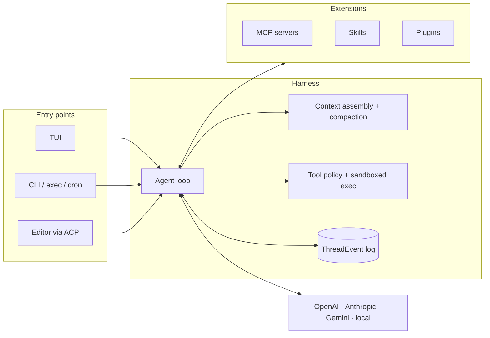
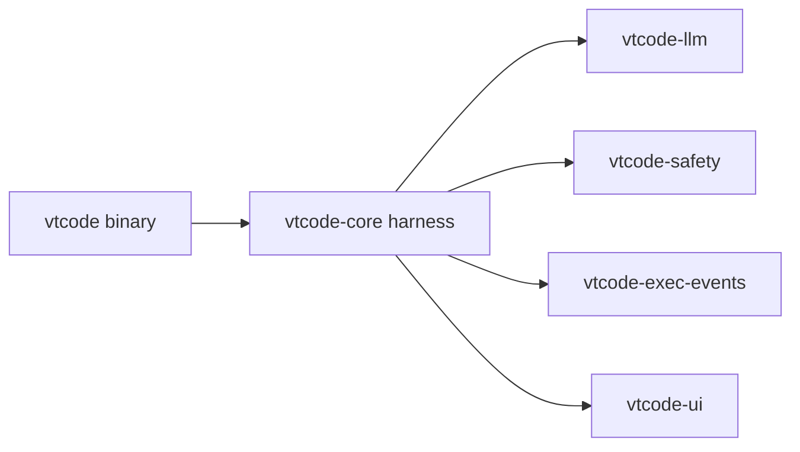

<div align="center">

<picture>
  
</picture>

**Secure, open, universal terminal coding agent in Rust.**

[](#license)
[](./docs/development/DEVELOPMENT_SETUP.md)
[](https://github.com/vinhnx/VTCode/releases)
[](https://agentskills.io/)
[](./docs/guides/zed-acp.md)
[](./docs/guides/mcp-integration.md)
[](./docs/guides/agent-plugins.md)
[](https://deepwiki.com/vinhnx/VTCode)

</div>

> [!TIP]
> New here? Start with [Installation](./docs/installation/README.md), then
> [Getting Started](./docs/user-guide/getting-started.md).

<details>
<summary><strong>Contents</strong></summary>

- [Overview](#overview)
- [Why VT Code](#why-vt-code)
- [Architecture](#architecture)
- [Quick start](#quick-start)
  - [1. Install](#1-install)
  - [2. Configure](#2-configure)
  - [3. Run](#3-run)
  - [WebMCP browser bridge (opt-in)](#webmcp-browser-bridge-opt-in)
- [What's inside](#whats-inside)
  - [Commands](#commands)
  - [Everyday recipes](#everyday-recipes)
- [Documentation](#documentation)
- [Development](#development)
- [Contributing](#contributing)
  - [Contributors](#contributors)
- [Support](#support)
  - [Sponsorship](#sponsorship)
- [License](#license)

</details>

## Overview

<div align="center">

<a href="https://www.producthunt.com/products/vt-code?embed=true&amp;utm_source=badge-featured&amp;utm_medium=badge&amp;utm_campaign=badge-vt-code" target="_blank" rel="noopener noreferrer"></a>


<br />

<em>Secure, open, universal.</em>

</div>

VT Code is an open-source terminal coding agent written in Rust: one static
binary for quick interactive sessions and long-running autonomous work alike,
no IDE required, no context left behind. It is a **harness, not just an LLM
wrapper**: the model reasons, and the runtime supplies tools, context,
sandboxing, state, and **verification** — turning raw model output into safe,
reviewable progress.

The full documentation catalog lives in the
[docs overview](./docs/README.md).

> [!NOTE]
> **Status:** Active development. Some automation flows are experimental and
> may change between releases. OAuth login for ChatGPT and GitHub Copilot
> reuses the Codex CLI's public client identity as an unofficial compatibility
> mechanism — bring your own provider API key if you need a supported path.
> See [OAuth authentication](./docs/guides/oauth-authentication.md).

<details>
<summary><strong>Behind the build</strong></summary>

- [Building VT Code, a year in](https://huggingface.co/blog/vinhnx90/building-vtcode-a-year-in)
  covering harness design, evals, security, and lessons learned.
- [Podcast](https://www.youtube.com/watch?v=XLoswcd5rH0) ·
  [Video](https://www.youtube.com/watch?v=PvL_kPjgU6o)

</details>

## Why VT Code

VT Code is built for work that takes more than one prompt: long tasks stay
dependable and reviewable from the first prompt to the final diff.

In practice, that means:

| What can go wrong                        | How VT Code responds                                                                                                                                                                                                                                                                            |
| ---------------------------------------- | ----------------------------------------------------------------------------------------------------------------------------------------------------------------------------------------------------------------------------------------------------------------------------------------------- |
| **Long tasks lose focus**                | Dynamic context assembly, project instructions, auto-compaction, and bounded tool output keep the active window useful. [Runtime guidance](./docs/development/runtime-guidance.md) · [Architecture](./docs/ARCHITECTURE.md)                                                                     |
| **Generated commands can cause damage**  | Policy checks and sandboxed, fail-closed execution defend against injection, path and symlink escape, and environment leakage. [Security model](./docs/development/COMMAND_SECURITY_MODEL.md)                                                                                                   |
| **A session is interrupted**             | Resume with `vtcode continue`, fork with `--session-id`, and inspect or restore changes with `vtcode snapshots` and `vtcode revert`. [Commands](./docs/user-guide/commands.md)                                                                                                                  |
| **“Done” is asserted without proof**     | Built-in evals verify the environment instead of trusting the agent's report, measured with pass@k and pass^k. [Eval guide](./docs/guides/eval.md)                                                                                                                                              |
| **Big changes ship unreviewed**          | The Planning Workflow keeps planning read-only: draft with `/plan`, approve at a review gate, then hand off to `build` or `auto`. [Planning workflow](./docs/guides/planning-workflow.md)                                                                                                       |
| **Edits land unseen**                    | Completed edits render as bounded, themed turn diffs with highlighting, so you review changes before they stack up. [Diff previews](./docs/development/diff-preview.md)                                                                                                                         |
| **Setup and teardown stay manual**       | Lifecycle hooks run shell commands on session and tool events; workspace hooks need explicit approval first. [Hooks guide](./docs/guides/hooks-guide.md)                                                                                                                                        |
| **Edits drift from project conventions** | Project instructions (`AGENTS.md`) are loaded into every turn, so the agent codes to your rules instead of rediscovering them. [Getting started](./docs/user-guide/getting-started.md)                                                                                                          |
| **Interactive only is not enough**       | Headless `vtcode exec` with JSON events, scheduled tasks via `vtcode schedule`, and isolated eval worktrees support CI, cron, and agent-to-agent flows. [Full automation](./docs/guides/full-automation.md)                                                                                     |
| **One provider locks you in**            | Built-in adapters for Gemini, OpenAI, Anthropic, DeepSeek, xAI, Meta, NVIDIA NIM, StepFun, and more — plus gateways such as OpenRouter and GitHub Copilot, OpenAI-compatible custom providers, local inference via Ollama, LM Studio, and llama.cpp, and a `providers_whitelist` for air-gapped setups. [Providers](./docs/providers/PROVIDER_GUIDES.md) |

The result is a terminal-native workflow that is:

- **Inspectable** — every run leaves a durable [`ThreadEvent`](./crates/common/vtcode-exec-events) record you can replay and audit.
- **Parallelizable** — run isolated loops in git worktrees with propose/verify sub-agents ([Loop engineering](./docs/loop-engineering.md)).
- **Extensible** — bring your own capabilities via MCP, Skills, Plugins, ACP, A2A, and WebMCP ([MCP](./docs/guides/mcp-integration.md) · [Plugins](./docs/guides/agent-plugins.md) · [ACP](./docs/guides/zed-acp.md)).
- **Keyboard-first** — a TUI built for the keyboard, with the terminal remaining the source of truth.
- **Scriptable** — the same harness drives the TUI, headless `exec`, `eval`, and `schedule`, so interactive and unattended runs behave identically.

VT Code is not just a model producing a plausible next response. It is a
runtime you can inspect, resume, extend, and verify.

## Architecture

One binary, four layers. Everything the model touches goes through the
harness; nothing bypasses it.



The TUI, headless `exec`/`ask`, cron schedules, and editors over ACP all drive
the same loop. For contributors, the layers map to workspace crates: entry
points in `vtcode` (`src/`) and `vtcode-acp`; the harness in `vtcode-core`
with `vtcode-safety` for policy and sandboxing; the `ThreadEvent` contract in
`vtcode-exec-events`; extensions in `vtcode-mcp`, `vtcode-skills`, and
`vtcode-agent-plugins`; provider clients in `vtcode-llm`.

For layer-by-layer details, extension seams, and internal composition rules,
see the [Architecture guide](./docs/ARCHITECTURE.md).

## Quick start

### 1. Install

```bash
curl -fsSL https://raw.githubusercontent.com/vinhnx/vtcode/main/scripts/install.sh | bash
# or: brew install vinhnx/tap/vtcode
# or: cargo install vtcode
```

### 2. Configure

```bash
cd path/to/your/project
vtcode init         # scaffolds config + AGENTS.md; review before committing
vtcode secret add openai   # stores the API key in your OS keyring
```

`/secret add <provider>` inside the TUI does the same. `vtcode login` covers
OAuth providers (ChatGPT, GitHub Copilot); plain env vars and workspace
`.env` still work for CI. See
[Getting started](./docs/user-guide/getting-started.md) for the credential
resolution order.

> [!CAUTION]
> Never commit API keys or put them in `vtcode.toml`.

### 3. Run

```bash
vtcode                  # interactive TUI: the whole loop is install, init, run
```

See [Commands](#commands) for the most common commands, including headless
`exec`, one-shot `ask`, and session resume.

### WebMCP browser bridge (opt-in)

Pair the TUI with a browser editor for authenticated, bounded workspace
editing:

```bash
/webmcp pair <origin>    # inside the TUI
```

See the [WebMCP user guide](./docs/user-guide/webmcp.md) for hosts and
deployment.

## What's inside

One static Rust binary: no runtime dependencies, no plugins to install,
nothing to wire up. Everything below ships in the default build.

**At a glance:** durable sessions · sandboxed execution · every major model ·
MCP, Skills & plugins · terminal-native TUI · built-in evals

### Commands

Bare `vtcode` opens the interactive TUI. Four subcommands cover most of the
work:

```bash
vtcode ask "explain Rc vs Arc"    # one-shot answer, no session, no tools
vtcode exec "refactor main.rs"    # headless task with the full tool loop
vtcode review                     # agent review of uncommitted changes
vtcode eval --suite suite.json    # verify behavior with pass@k metrics
```

The most common commands, flags, and workflows are documented in the
[command reference](./docs/user-guide/commands.md); run `vtcode --help` for
the full subcommand list.

A second tier handles session lifecycle and day-to-day operations:

| Command                              | Purpose                                                                               |
| ------------------------------------ | ------------------------------------------------------------------------------------- |
| `vtcode continue`                    | Resume the last session, or fork it into a new one with `--session-id`                |
| `vtcode exec resume`                 | Continue a finished headless run with a follow-up prompt: `--last` or a session id    |
| `vtcode schedule`                    | Durable recurring prompts, by cron or one-shot; `install-service` survives restarts   |
| `vtcode secret`                      | Store provider API keys in your OS keyring, never in shell history or workspace files |
| `vtcode models`                      | Inspect, test, and compare providers and models                                       |
| `vtcode snapshots` / `vtcode revert` | List and roll back to workspace snapshots                                             |
| `vtcode tool-policy`                 | Allow or deny specific tools per workspace                                            |
| `vtcode trajectory`                  | Pretty-print run logs for debugging and audits                                        |
| `vtcode skills` / `vtcode plugins`   | Manage skills and agent plugins                                                       |
| `vtcode mcp`                         | Connect and manage MCP servers                                                        |

`vtcode analyze`, `vtcode check`, `vtcode schema tools`, `vtcode dependencies`
(alias `deps`), `vtcode config`, `vtcode man`, and `vtcode update` round out
the operator surface, with editor/agent bridges (`vtcode acp`, `vtcode a2a`,
`vtcode webmcp`) and the state store (`vtcode session-store`) alongside. See
`vtcode --help` for the full list.

### Everyday recipes

```bash
# Review only the uncommitted diff, then exit with a verdict
vtcode review

# Weekly dependency audit (Mondays 09:00) as a durable cron job
vtcode schedule create --name "weekly-dep-audit" --cron "0 9 * * 1" --prompt "check for outdated deps and open an issue if any have CVEs"

# Resume yesterday's session and fork it for a new experiment
vtcode continue --session-id <id>

# Continue the last headless run with a follow-up prompt
vtcode exec resume --last "continue the refactor"

# See exactly what the agent did in the last run
vtcode trajectory
```

To pick up a specific exec session by id, use `vtcode exec resume <session-id> "..."`.
Headless `exec` usage: [exec mode guide](./docs/user-guide/exec-mode.md).
Durable cron schedules: [scheduled tasks guide](./docs/user-guide/scheduled-tasks.md).

## Documentation

| Layer   | Guides                                                                                                                                                                                                                                                                                   |
| ------- | ---------------------------------------------------------------------------------------------------------------------------------------------------------------------------------------------------------------------------------------------------------------------------------------- |
| Start   | [Installation](./docs/installation/README.md) · [Getting started](./docs/user-guide/getting-started.md) · [Wiki](https://github.com/vinhnx/VTCode/wiki)                                                                                                                                  |
| Use     | [TUI](./docs/user-guide/interactive-mode.md) · [CLI](./docs/user-guide/commands.md) · [WebMCP](./docs/user-guide/webmcp.md) · [Automation](./docs/guides/full-automation.md) · [Planning](./docs/guides/planning-workflow.md) · [Configuration](./docs/config/CONFIG_FIELD_REFERENCE.md) |
| Extend  | [Skills](./docs/skills/SKILLS_GUIDE.md) · [Plugins](./docs/guides/agent-plugins.md) · [MCP](./docs/guides/mcp-integration.md) · [Editors (ACP)](./docs/guides/zed-acp.md)                                                                                                                |
| Operate | [Safety](./docs/security/SECURITY_MODEL.md) · [Protocols](./docs/protocols/OPEN_RESPONSES.md) · [Loop engineering](./docs/loop-engineering.md) · [Architecture](./docs/ARCHITECTURE.md)                                                                                     |

The full catalog lives in the [Documentation Index](./docs/INDEX.md).

The [WebMCP hosted app](https://vtcode.vinhnx.chatgpt.site/)
([fallback mirror](https://vinhnx.github.io/VTCode/)) pairs with the TUI
bridge; deployment details live in the
[WebMCP deployment reference](./docs/reference/webmcp.md).

## Development



Rust stable, edition 2024, MSRV 1.93. Clone and run the fast gate:

```bash
git clone https://github.com/vinhnx/vtcode.git
cd vtcode
./scripts/run-debug.sh     # build and launch a debug binary
./scripts/check-dev.sh     # fast gate: clippy, fmt, check (10-30s)
cargo nextest run          # tests (never `cargo test`)
```

CI runs with `RUSTFLAGS="-D warnings"` and `--locked`; match locally with
`cargo check --locked`. See the
[development overview](./docs/development/README.md) and
[testing guide](./docs/development/testing.md) for details.

## Contributing

Contributions are welcome:

- **Code**: pick an open issue or propose one; keep changes surgical and
  covered by tests.
- **Docs**: fixes and new guides in `docs/`; every user-facing feature should
  land with its documentation.
- **Evals**: new suites and regression cases are high-leverage contributions;
  see the [eval guide](./docs/guides/eval.md) for suite authoring and metrics.
- **Bug reports**: include `vtcode trajectory` output when possible; it makes
  runs reproducible.

Before opening a PR: follow [Conventional Commits](https://www.conventionalcommits.org)
(`type(scope): subject`), run `./scripts/check-dev.sh` and `cargo nextest run`,
and keep the diff focused.

### Contributors

Thank you to everyone who shaped VT Code.

<details>
<summary><strong>Show all contributors</strong></summary>

<div align="center">
  <a href="https://github.com/kernitus"></a>&nbsp;
  <a href="https://github.com/7jrxt42BxFZo4iAnN4CX"></a>&nbsp;
  <a href="https://github.com/oiwn"></a>&nbsp;
  <a href="https://github.com/Sachin-Bhat"></a>&nbsp;
  <a href="https://github.com/chenrui333"></a>&nbsp;
  <a href="https://github.com/gzsombor"></a>&nbsp;
  <a href="https://github.com/leonj1"></a>&nbsp;
  <a href="https://github.com/netbrah"></a>&nbsp;
  <a href="https://github.com/xcrong"></a>&nbsp;
  <a href="https://github.com/mouse-value-add"></a>&nbsp;
  <a href="https://github.com/raphamorim"></a>&nbsp;
  <a href="https://github.com/nnfrog"></a>&nbsp;
  <a href="https://github.com/glmgbj233"></a>&nbsp;
  <a href="https://github.com/EvoLinkAI"></a>&nbsp;
  <a href="https://github.com/diegosouzapw"></a>&nbsp;
  <a href="https://github.com/ericcurtin"></a>&nbsp;
  <a href="https://github.com/ForrestThump"></a>&nbsp;
  <a href="https://github.com/morler"></a>&nbsp;
  <a href="https://github.com/poelzi"></a>&nbsp;
  <a href="https://github.com/RobertBorg"></a>&nbsp;
  <a href="https://github.com/Sanjays2402"></a>&nbsp;
  <a href="https://github.com/TuanLe-bk18"></a>&nbsp;
  <a href="https://github.com/uiYzzi"></a>
</div>

</details>

## Support

### Sponsorship

VT Code is built and maintained in spare time. If it helped you ship or learn
something, a [sponsorship](https://github.com/sponsors/vinhnx) keeps the
project independent.

<div align="center">
  <a href="https://github.com/dnhn"></a>
  <a href="https://github.com/codemod"></a>
  <a href="https://github.com/coderabbitai"></a>
  <a href="https://github.com/KhaiRyth"></a>
</div>

<div align="center">

[](https://github.com/sponsors/vinhnx)
<a href="https://buymeacoffee.com/vinhnx"></a>

</div>

## License

First-party code is **MIT OR Apache-2.0**. See [LICENSE](LICENSE).
Third-party code keeps its original licenses: see
[THIRD-PARTY-NOTICES](THIRD-PARTY-NOTICES).
