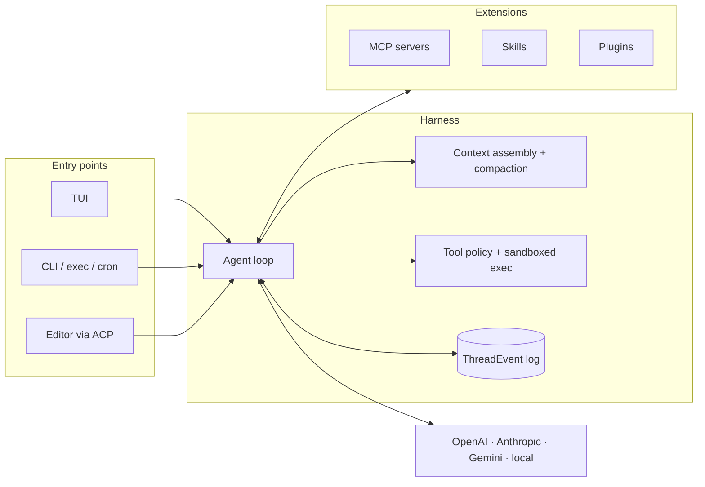
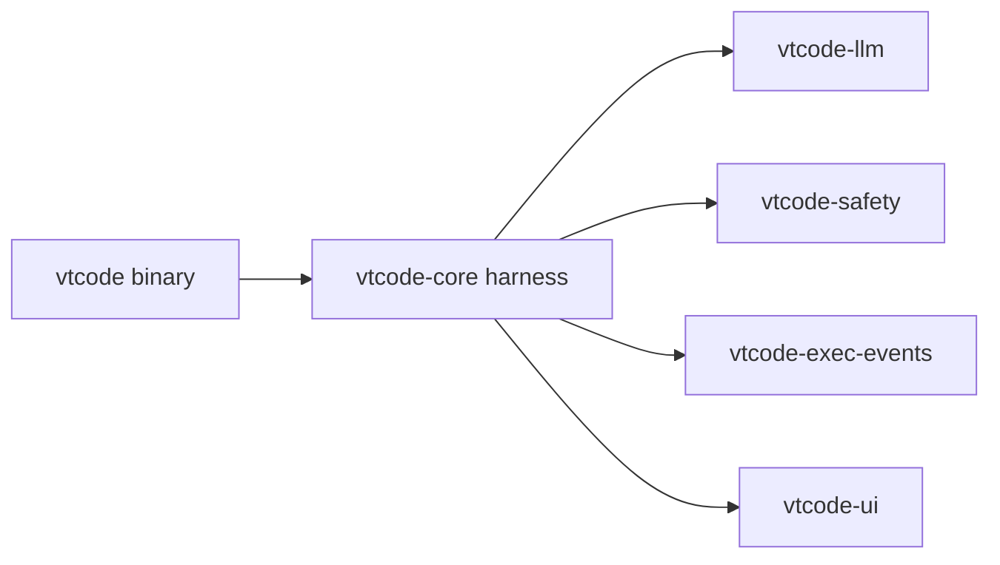

<div align="center">

<picture>
  
</picture>

**An open-source terminal coding agent built in Rust.**

[](#license)
[](https://agentskills.io/)
[](./docs/guides/zed-acp.md)
[](./docs/guides/mcp-integration.md)
[](./docs/guides/agent-plugins.md)
[](https://deepwiki.com/vinhnx/VTCode)

</div>

> [!TIP]
> New here? Start with [Installation](./docs/installation/README.md), then
> [Getting Started](./docs/user-guide/getting-started.md).

<details>
<summary><strong>Contents</strong></summary>

- [Overview](#overview)
- [Quick start](#quick-start)
  - [1. Install](#1-install)
  - [2. Configure](#2-configure)
  - [3. Run](#3-run)
- [Why VT Code](#why-vt-code)
- [Architecture](#architecture)
- [Usage](#usage)
  - [Commands](#commands)
  - [Everyday recipes](#everyday-recipes)
  - [WebMCP browser bridge (opt-in)](#webmcp-browser-bridge-opt-in)
- [Documentation](#documentation)
- [Development](#development)
- [Contributing](#contributing)
  - [Contributors](#contributors)
- [Support](#support)
  - [Contact](#contact)
  - [Share VT Code](#share-vt-code)
  - [Sponsorship](#sponsorship)
- [License](#license)

</details>

## Overview

VT Code is a coding agent for your terminal: interactive TUI, headless
`exec`, and scheduled runs in one Rust binary. The model proposes work; the
runtime provides tools, context management, and command policy, and you
review changes before they land.

<div align="center">

<a href="https://www.producthunt.com/products/vt-code?embed=true&amp;utm_source=badge-featured&amp;utm_medium=badge&amp;utm_campaign=badge-vt-code" target="_blank" rel="noopener noreferrer"></a>


<br />

<em>Plan, run, and review coding work from your terminal.</em>

</div>

Full docs catalog: [docs overview](./docs/README.md).

> [!NOTE]
> **Status:** Active development; some automation flows are experimental.
> OAuth login for ChatGPT and GitHub Copilot reuses the Codex CLI's public
> client identity (unofficial); prefer your own API key for supported paths.
> See [OAuth authentication](./docs/guides/oauth-authentication.md).

<details>
<summary><strong>Behind the build</strong></summary>

- [Building VT Code, a year in](https://huggingface.co/blog/vinhnx90/building-vtcode-a-year-in)
  covering harness design, evals, security, and lessons learned.
- [Podcast](https://www.youtube.com/watch?v=XLoswcd5rH0) ·
  [Video](https://www.youtube.com/watch?v=PvL_kPjgU6o)

</details>

## Quick start

### 1. Install

```bash
curl -fsSL https://raw.githubusercontent.com/vinhnx/vtcode/main/scripts/install.sh | bash
```

The installer also sets up `ripgrep` and `ast-grep` on macOS/Linux. Other
methods from the [installation guide](./docs/installation/README.md):

```bash
brew trust vinhnx/tap
brew install vinhnx/tap/vtcode
# or, if you have Rust: cargo install vtcode
```

> [!NOTE]
> Windows artifacts are best-effort and may lag behind macOS/Linux; see the
> [installation guide](./docs/installation/README.md).

### 2. Configure

In your project, initialize workspace instructions and add a provider key:

```bash
cd path/to/your/project
vtcode init                # scaffolds config + AGENTS.md; review before committing
vtcode secret add openai   # stores an OpenAI API key in your OS keyring
```

Any provider works in place of `openai`. Env vars or a workspace `.env` also
work; `vtcode login` covers supported OAuth providers. Credential options:
[Getting started](./docs/user-guide/getting-started.md).

> [!CAUTION]
> Never commit API keys or put them in `vtcode.toml`.

### 3. Run

```bash
vtcode   # open the interactive TUI in your project
```

Ask for a change, inspect the result, keep or discard it. For headless tasks
and sessions, see [Commands](#commands).

## Why VT Code

For work that takes more than one prompt:

- **Context that persists.** Project instructions, context assembly, and
  compaction for long sessions. [Runtime guidance](./docs/development/runtime-guidance.md)
- **Controlled tool use.** Command policy and sandboxing at the execution
  boundary. [Security model](./docs/development/COMMAND_SECURITY_MODEL.md)
- **Revisitable sessions.** `vtcode continue`, `vtcode trajectory`,
  workspace snapshots. [Command reference](./docs/user-guide/commands.md)
- **A review path.** Plan read-only before implementing; inspect edits in
  turn diffs. [Planning workflow](./docs/guides/planning-workflow.md) ·
  [Diff previews](./docs/development/diff-preview.md)
- **Beyond the TUI.** Headless `vtcode exec`, scheduled prompts, MCP,
  Skills, and Plugins. [Full automation](./docs/guides/full-automation.md) ·
  [Providers](./docs/providers/PROVIDER_GUIDES.md)

For repeatable, environment-checked results, use the
[eval framework](./docs/guides/eval.md); an agent's completion message alone
is not a verification result.

## Architecture

One binary, four layers. Everything the model touches goes through the
harness; nothing bypasses it.



The TUI, headless `exec`/`ask`, cron schedules, and editors over ACP all
drive the same loop. Layers map to workspace crates: entry points in
`vtcode` and `vtcode-acp`; the harness in `vtcode-core` (policy and
sandboxing in `vtcode-safety`); the `ThreadEvent` contract in
`vtcode-exec-events`; extensions in `vtcode-mcp`, `vtcode-skills`, and
`vtcode-agent-plugins`; provider clients in `vtcode-llm`.

Layer-by-layer details: [Architecture guide](./docs/ARCHITECTURE.md).

## Usage

One binary: TUI, session tools, provider integrations, and an eval runner.

### Commands

Run `vtcode` for the TUI; pick a subcommand for a specific task:

```bash
vtcode ask "explain Rc vs Arc"    # one-shot answer, no session, no tools
vtcode exec "refactor main.rs"    # headless task with the full tool loop
vtcode review                     # agent review of uncommitted changes
vtcode eval --suite suite.json    # verify behavior with pass@k metrics
```

Common commands, flags, and workflows: [command reference](./docs/user-guide/commands.md).

For session lifecycle and day-to-day operations:

| Command                              | Purpose                                                                               |
| ------------------------------------ | ------------------------------------------------------------------------------------- |
| `vtcode continue`                    | Resume the last session, or fork it into a new one with `--session-id`                |
| `vtcode init`                        | Scaffold `vtcode.toml` and `AGENTS.md` in the workspace; review before committing     |
| `vtcode exec resume`                 | Continue a finished headless run with a follow-up prompt: `--last` or a session id    |
| `vtcode schedule`                    | Durable recurring prompts, by cron or one-shot; `install-service` survives restarts   |
| `vtcode secret`                      | Store provider API keys in your OS keyring, never in shell history or workspace files |
| `vtcode login`                       | OAuth sign-in for ChatGPT and GitHub Copilot; see [OAuth authentication](./docs/guides/oauth-authentication.md) |
| `vtcode auth`                        | Show authentication status for one provider or all supported providers               |
| `vtcode models`                      | Inspect, test, and compare providers and models                                       |
| `vtcode snapshots` / `vtcode revert` | List and roll back to workspace snapshots                                             |
| `vtcode tool-policy`                 | Allow or deny specific tools per workspace                                            |
| `vtcode trajectory`                  | Pretty-print run logs for debugging and audits                                        |
| `vtcode skills` / `vtcode plugins`   | Manage skills and agent plugins                                                       |
| `vtcode mcp`                         | Connect and manage MCP servers                                                        |

More: `vtcode config`, `vtcode dependencies`, `vtcode acp`, `vtcode a2a`,
`vtcode webmcp`, `vtcode session-store`, `vtcode schema` (built-in tool
schemas), `vtcode analyze` (workspace structure/security/performance),
`vtcode check` (built-in repository checks), and `vtcode man` (man pages).
Full list: `vtcode --help` or the
[command reference](./docs/user-guide/commands.md).

### Everyday recipes

```bash
# Review only the uncommitted diff, then exit with a verdict
vtcode review

# Weekly dependency audit (Mondays 09:00) as a durable cron job
vtcode schedule create --name "weekly-dep-audit" --cron "0 9 * * 1" --prompt "check for outdated deps and open an issue if any have CVEs"

# Resume yesterday's session and fork it for a new experiment
vtcode continue --session-id <id>

# Continue the last headless run with a follow-up prompt
vtcode exec resume --last "continue the refactor"

# See exactly what the agent did in the last run
vtcode trajectory
```

Pick a specific exec session by id: `vtcode exec resume <session-id> "..."`.
Headless `exec`: [exec mode guide](./docs/user-guide/exec-mode.md) ·
Cron schedules: [scheduled tasks guide](./docs/user-guide/scheduled-tasks.md).

### WebMCP browser bridge (opt-in)

Pair the TUI with a browser editor for authenticated, bounded editing:

```bash
/webmcp pair <origin>    # inside the TUI
```

Hosts and deployment: [WebMCP user guide](./docs/user-guide/webmcp.md).

## Documentation

Per-subcommand details are in the
[command reference](./docs/user-guide/commands.md).

| Layer   | Guides                                                                                                                                                                                                                                                                                   |
| ------- | ---------------------------------------------------------------------------------------------------------------------------------------------------------------------------------------------------------------------------------------------------------------------------------------- |
| Start   | [Installation](./docs/installation/README.md) · [Getting started](./docs/user-guide/getting-started.md) · [OAuth login](./docs/guides/oauth-authentication.md) · [FAQ](./docs/FAQ.md) · [Compatibility](./docs/COMPATIBILITY.md) · [Wiki](https://github.com/vinhnx/VTCode/wiki)                                                                  |
| Use     | [TUI](./docs/user-guide/interactive-mode.md) · [CLI](./docs/user-guide/commands.md) · [Exec mode](./docs/user-guide/exec-mode.md) · [Scheduled tasks](./docs/user-guide/scheduled-tasks.md) · [WebMCP](./docs/user-guide/webmcp.md) |
| Automate | [Automation](./docs/guides/full-automation.md) · [Hooks](./docs/guides/hooks-guide.md) · [Planning](./docs/guides/planning-workflow.md) · [Configuration](./docs/config/CONFIG_FIELD_REFERENCE.md) |
| Extend  | [Skills](./docs/skills/SKILLS_GUIDE.md) · [Plugins](./docs/guides/agent-plugins.md) · [MCP](./docs/guides/mcp-integration.md) · [Editors (ACP)](./docs/guides/zed-acp.md)                                                                                                                |
| Operate | [Safety](./docs/security/SECURITY_MODEL.md) · [Evals](./docs/guides/eval.md) · [Protocols](./docs/protocols/OPEN_RESPONSES.md) · [Loop engineering](./docs/project/PLAN-loop-engineering.md) · [Architecture](./docs/ARCHITECTURE.md) |

Can't find a topic? [Documentation Index](./docs/INDEX.md).

The [WebMCP hosted app](https://vtcode.vinhnx.chatgpt.site/)
([mirror](https://vinhnx.github.io/VTCode/)) pairs with the TUI bridge;
deployment: [WebMCP deployment reference](./docs/reference/webmcp.md).

## Development



Rust stable, edition 2024, MSRV 1.98.1. Clone and run the fast gate:

```bash
git clone https://github.com/vinhnx/vtcode.git
cd vtcode
./scripts/run-debug.sh     # build and launch a debug binary
./scripts/check-dev.sh     # fast gate: clippy, fmt, check (10-30s)
cargo nextest run          # tests (never `cargo test`)
```

CI runs with `RUSTFLAGS="-D warnings"` and `--locked`; match locally with
`cargo check --locked`. Details: [development overview](./docs/development/README.md)
· [testing guide](./docs/development/testing.md).

Release binaries and notes: [GitHub releases](https://github.com/vinhnx/vtcode/releases)
(Windows artifacts may lag behind macOS/Linux).

## Contributing

Contributions are welcome:

- **Code**: pick or propose an issue; keep changes surgical and tested.
- **Docs**: every user-facing feature lands with its documentation.
- **Evals**: new suites and regression cases are high-leverage; see the
  [eval guide](./docs/guides/eval.md).
- **Bug reports**: include `vtcode trajectory` output when possible.

Before a PR: [Conventional Commits](https://www.conventionalcommits.org)
(`type(scope): subject`), `./scripts/check-dev.sh` + `cargo nextest run`,
focused diff.

### Contributors

VT Code is what it is because of the people who build, test, and improve it
alongside me. Thank you, all of you.

<details>
<summary><strong>Show all contributors</strong></summary>

<!-- CONTRIBUTORS:START -->

**Security Advisors**

  <a href="https://github.com/glmgbj233"></a>&nbsp;
  <a href="https://github.com/nnfrog"></a>&nbsp;

**Main Contributor**

  <a href="https://github.com/kernitus"></a>&nbsp;

**Core Contributors**

  <a href="https://github.com/7jrxt42BxFZo4iAnN4CX"></a>&nbsp;
  <a href="https://github.com/oiwn"></a>&nbsp;
  <a href="https://github.com/Sachin-Bhat"></a>&nbsp;
  <a href="https://github.com/chenrui333"></a>&nbsp;
  <a href="https://github.com/xcrong"></a>&nbsp;
  <a href="https://github.com/netbrah"></a>&nbsp;
  <a href="https://github.com/mouse-value-add"></a>&nbsp;
  <a href="https://github.com/leonj1"></a>&nbsp;
  <a href="https://github.com/gzsombor"></a>&nbsp;

**Contributors**

  <a href="https://github.com/ct-jaryn"></a>&nbsp;
  <a href="https://github.com/vivekgupta-memcode"></a>&nbsp;
  <a href="https://github.com/S2thend"></a>&nbsp;
  <a href="https://github.com/uiYzzi"></a>&nbsp;
  <a href="https://github.com/TuanLe-bk18"></a>&nbsp;
  <a href="https://github.com/Sanjays2402"></a>&nbsp;
  <a href="https://github.com/RobertBorg"></a>&nbsp;
  <a href="https://github.com/raphamorim"></a>&nbsp;
  <a href="https://github.com/poelzi"></a>&nbsp;
  <a href="https://github.com/morler"></a>&nbsp;
  <a href="https://github.com/ForrestThump"></a>&nbsp;
  <a href="https://github.com/EvoLinkAI"></a>&nbsp;
  <a href="https://github.com/ericcurtin"></a>&nbsp;
  <a href="https://github.com/diegosouzapw"></a>&nbsp;

<!-- CONTRIBUTORS:END -->

</details>

**Want to see your avatar here?** Every bit counts: one-line fixes, bug
reports, and feedback are all welcome.

[Report a bug](https://github.com/vinhnx/vtcode/issues/new?template=bug_report.md) ·
[Request a feature](https://github.com/vinhnx/vtcode/issues/new?template=feature_request.md) ·
[Share feedback](https://github.com/vinhnx/vtcode/discussions) ·
[Star the repo](https://github.com/vinhnx/vtcode/stargazers) ·
[Contribute](./docs/CONTRIBUTING.md)

## Support

### Contact

Partnership and collaboration: `vinhnguyen2308 [at] gmail [dot] com`.
Bugs and feature requests: [GitHub Issues](https://github.com/vinhnx/vtcode/issues).
Security vulnerabilities: report privately via
[GitHub private vulnerability reporting](https://github.com/vinhnx/vtcode/security/advisories/new);
never open a public issue. Details: [security policy](./docs/SECURITY.md).

### Share VT Code

If VT Code helped you ship something, telling other developers is the
easiest way to support the project:

[Share on X](https://twitter.com/intent/tweet?text=VT%20Code%20is%20an%20open-source%20coding%20agent%20for%20your%20terminal&url=https%3A%2F%2Fgithub.com%2Fvinhnx%2Fvtcode) ·
[Share on Hacker News](https://news.ycombinator.com/submitlink?u=https%3A%2F%2Fgithub.com%2Fvinhnx%2Fvtcode&t=VT%20Code%20%E2%80%93%20Open-source%20coding%20agent%20for%20your%20terminal) ·
[Share on LinkedIn](https://www.linkedin.com/sharing/share-offsite/?url=https%3A%2F%2Fgithub.com%2Fvinhnx%2Fvtcode) ·
[Share via Email](mailto:?subject=VT%20Code%3A%20open-source%20coding%20agent%20for%20your%20terminal&body=Check%20out%20VT%20Code%2C%20an%20open-source%20coding%20agent%20for%20your%20terminal%3A%20https%3A%2F%2Fgithub.com%2Fvinhnx%2Fvtcode) ·
[Share via SMS](sms:?&body=Check%20out%20VT%20Code%2C%20an%20open-source%20coding%20agent%20for%20your%20terminal%3A%20https%3A%2F%2Fgithub.com%2Fvinhnx%2Fvtcode)

### Sponsorship

VT Code is maintained in spare time. A [sponsorship](https://github.com/sponsors/vinhnx)
keeps the project independent.

<details>
<summary><strong>Sponsors</strong></summary>

<a href="https://github.com/dnhn"></a>
<a href="https://github.com/codemod"></a>
<a href="https://github.com/coderabbitai"></a>
<a href="https://github.com/KhaiRyth"></a>

</details>

[](https://github.com/sponsors/vinhnx)
[](https://buymeacoffee.com/vinhnx)

## License

First-party code is **MIT OR Apache-2.0** ([LICENSE](LICENSE)); third-party
code keeps its original licenses ([THIRD-PARTY-NOTICES](THIRD-PARTY-NOTICES)).
