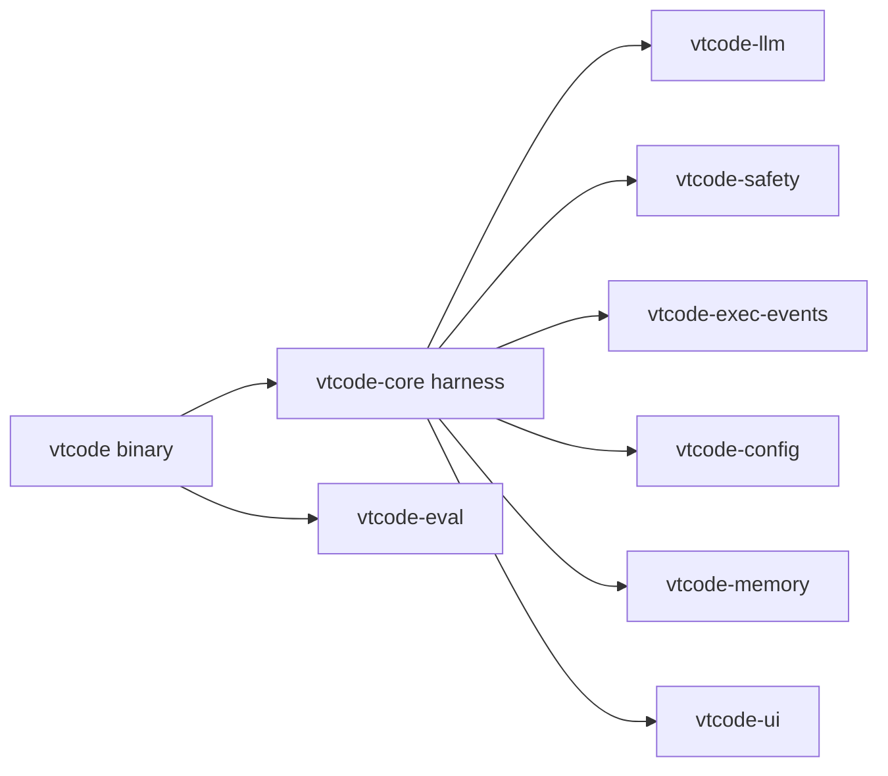

# VT Code

<div align="center">

<picture>
  
</picture>

**An open-source terminal coding agent built in Rust.**

[](#license)
[](https://agentskills.io/)
[](./docs/guides/zed-acp.md)
[](./docs/guides/mcp-integration.md)
[](./docs/guides/agent-plugins.md)
[](https://deepwiki.com/vinhnx/VTCode)
<!-- markdownlint-disable-next-line MD013 -->
<a href="https://www.producthunt.com/products/vt-code?embed=true&amp;utm_source=badge-featured&amp;utm_medium=badge&amp;utm_campaign=badge-vt-code" target="_blank" rel="noopener noreferrer"></a>

</div>

> [!TIP] New here? Start with [Installation](./docs/installation/README.md), then
> [Getting Started](./docs/user-guide/getting-started.md).

<details>
<summary><strong>Contents</strong></summary>

- [Overview](#overview)
- [Quick start](#quick-start)
  - [1. Install](#1-install)
  - [2. Configure your project](#2-configure-your-project)
  - [3. Run your first task](#3-run-your-first-task)
- [Usage](#usage)
  - [Interactive](#interactive)
  - [Headless](#headless)
  - [Scheduled tasks](#scheduled-tasks)
  - [Sessions](#sessions)
- [Integrations](#integrations)
- [Documentation](#documentation)
- [Development](#development)
- [Contributing](#contributing)
- [Community](#community)
  - [Contact](#contact)
  - [Resources](#resources)
  - [Share VT Code](#share-vt-code)
  - [Sponsorship](#sponsorship)
- [License](#license)

</details>

## Overview

VT Code is an open-source terminal coding agent built in Rust. Explore a codebase, plan changes, run tools, and review
edits in the interactive TUI, or run `vtcode exec` headless. You pick the model and permissions; the runtime handles
context, tools, and execution policy.

- **Plan and review:** read-only planning mode, then turn diffs.
- **Sustain long sessions:** project instructions, compaction, resumption, execution logs.
- **Control execution:** command policy and sandboxing.
- **Choose your stack:** hosted or local models, plus MCP, Skills, and Plugins.

<div align="center">


<br />

<em>Plan, run, and review coding work from your terminal.</em>

</div>

> [!NOTE] **Status:** Active development; some automation flows are experimental.

## Quick start

### 1. Install

```bash
curl -fsSL https://raw.githubusercontent.com/vinhnx/VTCode/main/scripts/install.sh | bash
```

The installer also sets up `ripgrep` and `ast-grep` on macOS/Linux. Or use Homebrew or Cargo:

```bash
brew trust vinhnx/tap
brew install vinhnx/tap/vtcode

# Or install with Rust
cargo install vtcode
```

See the [installation guide](./docs/installation/README.md) for prerequisites, other methods, and the installer script
you can review before running.

> [!NOTE] Windows artifacts are best-effort and may lag behind macOS/Linux.

### 2. Configure your project

Open your project, initialize its configuration and instructions, then add credentials for your chosen provider. For
example, with OpenAI:

```bash
cd path/to/your/project
vtcode init                # scaffolds config + AGENTS.md; review before committing
vtcode secret add openai   # stores an OpenAI API key in your OS keyring
```

Replace `openai` with your supported provider. Credentials can also come from environment variables or a workspace
`.env`; `vtcode login` handles supported login flows. See [Getting started](./docs/user-guide/getting-started.md) and
[Provider guides](./docs/providers/PROVIDER_GUIDES.md).

> [!NOTE] ChatGPT OAuth reuses the Codex CLI's public client identity via an unofficial compatibility flow; prefer your
> own OpenAI API key. GitHub Copilot uses the official `copilot` CLI. See
> [OAuth authentication](./docs/guides/oauth-authentication.md).
>
> [!CAUTION] Never commit API keys or put them in `vtcode.toml`.

### 3. Run your first task

```bash
vtcode   # open the interactive TUI in your project
```

Start with a focused request, such as “Explain how this project handles authentication,” then review the diff and test
results before committing. For automation and session commands, see [Usage](#usage).

## Usage

### Interactive

Use `vtcode` to explore a codebase, plan a change, and implement it in the TUI. For larger tasks, start with
[read-only planning](./docs/guides/planning-workflow.md) and review [turn diffs](./docs/development/diff-preview.md)
before committing. See the [interactive guide](./docs/user-guide/interactive-mode.md) for controls.

### Headless

Run tasks without the TUI: `ask` for a tool-free answer, `exec` for a tool-enabled coding task, and `review` for
uncommitted changes:

```bash
vtcode ask "explain Rc vs Arc"    # one-shot answer, no session, no tools
vtcode exec "refactor main.rs"    # headless task with the full tool loop
vtcode review                     # agent review of uncommitted changes
```

`exec` requires autonomous execution enabled in `[automation.full_auto]` plus `full_auto` workspace trust: a terminal
prompts for trust, while non-TTY runs fail unless you set `VTCODE_TRUST_WORKSPACE=full-auto`. Full-auto's tool
allow-list, explicit denies, and execution policy still apply. See [exec mode](./docs/user-guide/exec-mode.md) for trust
and output options and [full automation](./docs/guides/full-automation.md) for configuration.

For repeatable, environment-checked results, use the [eval framework](./docs/guides/eval.md) — a completion message
alone is not verification.

### Scheduled tasks

For recurring work, use [scheduled tasks](./docs/user-guide/scheduled-tasks.md): durable prompt jobs on the same exec
runtime.

```bash
# Weekly dependency audit (Mondays 09:00)
vtcode schedule create --name "weekly-dep-audit" \
  --cron "0 9 * * 1" \
  --prompt "Check for outdated dependencies and report known vulnerabilities"
```

### Sessions

Resume or inspect earlier work:

```bash
# Resume the most recent interactive session
vtcode continue

# Continue the last headless run with a follow-up prompt
vtcode exec resume --last "continue the refactor"

# Inspect the execution log
vtcode trajectory
```

Use `vtcode continue --session-id <id>` to fork an earlier session.

## Integrations

Enable these only when you need them; none are required for the quick start.

- **Extensions:** [MCP servers](./docs/guides/mcp-integration.md), [Agent Skills](./docs/skills/SKILLS_GUIDE.md), and
  [Plugins](./docs/guides/agent-plugins.md).
- **Editor integration:** [ACP with Zed](./docs/guides/zed-acp.md).
- **Cross-thread memory:** [Memcode MCP](./docs/guides/memcode-mcp.md) carries context between tasks; see the
  [write-up](https://memcode.in/blogs/vt-code-memory-across-threads).
- **Browser editing:** [WebMCP](./docs/user-guide/webmcp.md) pairs the TUI with an authenticated browser editor:

```bash
/webmcp pair <origin>    # inside the TUI
```

The hosted app at [vtcode.vinhnx.chatgpt.site](https://vtcode.vinhnx.chatgpt.site/)
([mirror](https://vinhnx.github.io/VTCode/)) uses this authenticated, workspace-scoped bridge. See the
[WebMCP user guide](./docs/user-guide/webmcp.md) and [deployment reference](./docs/reference/webmcp.md).

## Documentation

Guides by task; the full catalog lives in the [documentation index](./docs/INDEX.md), the
[docs overview](./docs/README.md), and the [Wiki](https://github.com/vinhnx/VTCode/wiki):

| Goal                 | Guides                                                                                                                                                                                                                                                                                                         |
| -------------------- | -------------------------------------------------------------------------------------------------------------------------------------------------------------------------------------------------------------------------------------------------------------------------------------------------------------- |
| Get started          | [Installation](./docs/installation/README.md) · [Getting started](./docs/user-guide/getting-started.md) · [Providers](./docs/providers/PROVIDER_GUIDES.md) · [OAuth login](./docs/guides/oauth-authentication.md) · [FAQ](./docs/FAQ.md) · [Compatibility](./docs/COMPATIBILITY.md)                            |
| Work interactively   | [TUI](./docs/user-guide/interactive-mode.md) · [Command reference](./docs/user-guide/commands.md) · [Planning](./docs/guides/planning-workflow.md) · [Turn diffs](./docs/development/diff-preview.md) · [Configuration](./docs/config/CONFIG_FIELD_REFERENCE.md) · [Safety](./docs/security/SECURITY_MODEL.md) |
| Automate tasks       | [Exec mode](./docs/user-guide/exec-mode.md) · [Full automation](./docs/guides/full-automation.md) · [Scheduled tasks](./docs/user-guide/scheduled-tasks.md) · [Hooks](./docs/guides/hooks-guide.md)                                                                                                            |
| Extend VT Code       | [Skills](./docs/skills/SKILLS_GUIDE.md) · [Plugins](./docs/guides/agent-plugins.md) · [MCP](./docs/guides/mcp-integration.md) · [Editors (ACP)](./docs/guides/zed-acp.md) · [WebMCP](./docs/user-guide/webmcp.md) · [Memcode](./docs/guides/memcode-mcp.md)                                                    |
| Develop and evaluate | [Development](./docs/development/README.md) · [Testing](./docs/development/testing.md) · [Evals](./docs/guides/eval.md) · [Architecture](./docs/ARCHITECTURE.md) · [Protocols](./docs/protocols/OPEN_RESPONSES.md) · [Loop engineering](./docs/project/PLAN-loop-engineering.md)                               |

## Development


```mermaid
graph LR
    BIN[vtcode binary] --> CORE[vtcode-core harness]
    BIN --> EVAL[vtcode-eval]
    CORE --> LLM[vtcode-llm]
    CORE --> SAFETY[vtcode-safety]
    CORE --> EVENTS[vtcode-exec-events]
    CORE --> CONFIG[vtcode-config]
    CORE --> MEMORY[vtcode-memory]
    CORE --> UI[vtcode-ui]
```

Full 23-crate workspace map: [Architecture guide](./docs/ARCHITECTURE.md). Requires Rust 1.98.1+ (edition 2024) and
`cargo-nextest` for tests:

```bash
git clone https://github.com/vinhnx/VTCode.git
cd VTCode
./scripts/run-debug.sh     # build and launch a debug binary
./scripts/check-dev.sh     # fast gate: clippy, fmt, check
cargo nextest run          # tests (requires cargo-nextest)
```

CI sets `RUSTFLAGS="-D warnings"` and builds with `--locked`; match locally with
`RUSTFLAGS="-D warnings" cargo check --locked`. Setup and checks: [development overview](./docs/development/README.md) ·
[testing guide](./docs/development/testing.md).

Release binaries and notes: [GitHub releases](https://github.com/vinhnx/VTCode/releases).

## Contributing

Contributions are welcome:

- **Code**: pick or propose an issue; keep changes surgical and tested.
- **Docs**: every user-facing feature lands with its documentation.
- **Evals**: new suites and regression cases are high-leverage; see the [eval guide](./docs/guides/eval.md).
- **Bug reports**: include `vtcode trajectory` output when possible.

Before a PR, see the [contribution guide](./docs/CONTRIBUTING.md): Conventional Commits (`type(scope): subject`),
`./scripts/check-dev.sh` + `cargo nextest run`, and a focused diff.

## Community

Thanks to everyone who builds, tests, and improves VT Code alongside me.

<details>
<summary>View all contributors</summary>

<!-- CONTRIBUTORS:START -->

<!-- markdownlint-disable MD013 -->
### Security Advisors

<a href="https://github.com/glmgbj233"></a>&nbsp;
<a href="https://github.com/nnfrog"></a>&nbsp;

### Main Contributor

<a href="https://github.com/kernitus"></a>&nbsp;

### Core Contributors

<a href="https://github.com/7jrxt42BxFZo4iAnN4CX"></a>&nbsp;
<a href="https://github.com/oiwn"></a>&nbsp;
<a href="https://github.com/Sachin-Bhat"></a>&nbsp;
<a href="https://github.com/chenrui333"></a>&nbsp;
<a href="https://github.com/xcrong"></a>&nbsp;
<a href="https://github.com/netbrah"></a>&nbsp;
<a href="https://github.com/mouse-value-add"></a>&nbsp;
<a href="https://github.com/leonj1"></a>&nbsp;
<a href="https://github.com/gzsombor"></a>&nbsp;

### Contributors

<a href="https://github.com/ct-jaryn"></a>&nbsp;
<a href="https://github.com/vivekgupta-memcode"></a>&nbsp;
<a href="https://github.com/S2thend"></a>&nbsp;
<a href="https://github.com/uiYzzi"></a>&nbsp;
<a href="https://github.com/TuanLe-bk18"></a>&nbsp;
<a href="https://github.com/Sanjays2402"></a>&nbsp;
<a href="https://github.com/RobertBorg"></a>&nbsp;
<a href="https://github.com/raphamorim"></a>&nbsp;
<a href="https://github.com/poelzi"></a>&nbsp;
<a href="https://github.com/morler"></a>&nbsp;
<a href="https://github.com/ForrestThump"></a>&nbsp;
<a href="https://github.com/EvoLinkAI"></a>&nbsp;
<a href="https://github.com/ericcurtin"></a>&nbsp;
<a href="https://github.com/diegosouzapw"></a>&nbsp;
<!-- markdownlint-enable MD013 -->

<!-- CONTRIBUTORS:END -->

</details>

**Want to see your avatar here?** Every bit counts: one-line fixes, bug reports, and feedback are all welcome.

[Report a bug](https://github.com/vinhnx/VTCode/issues/new?template=bug_report.md) ·
[Request a feature](https://github.com/vinhnx/VTCode/issues/new?template=feature_request.md) ·
[Share feedback](https://github.com/vinhnx/VTCode/discussions) ·
[Star the repo](https://github.com/vinhnx/VTCode/stargazers) · [Contribute](./docs/CONTRIBUTING.md)

### Contact

Partnerships and collaboration: `vinhnguyen2308 [at] gmail [dot] com`. Bugs and feature requests:
[GitHub Issues](https://github.com/vinhnx/VTCode/issues). Security vulnerabilities: report privately via
[GitHub private vulnerability reporting](https://github.com/vinhnx/VTCode/security/advisories/new); never open a public
issue. Details: [security policy](./docs/SECURITY.md).

### Resources

- [Building VT Code, a year in](https://huggingface.co/blog/vinhnx90/building-vtcode-a-year-in): harness design, evals,
  security, lessons learned.
- [Podcast](https://www.youtube.com/watch?v=XLoswcd5rH0) · [Video](https://www.youtube.com/watch?v=PvL_kPjgU6o)

### Share VT Code

If VT Code helped you ship something, telling other developers is the easiest way to support it:

[Share on X](https://twitter.com/intent/tweet?text=VT%20Code%20is%20an%20open-source%20coding%20agent%20for%20your%20terminal&url=https%3A%2F%2Fgithub.com%2Fvinhnx%2Fvtcode)
·
[Share on Hacker News](https://news.ycombinator.com/submitlink?u=https%3A%2F%2Fgithub.com%2Fvinhnx%2Fvtcode&t=VT%20Code%20%E2%80%93%20Open-source%20coding%20agent%20for%20your%20terminal)
· [Share on LinkedIn](https://www.linkedin.com/sharing/share-offsite/?url=https%3A%2F%2Fgithub.com%2Fvinhnx%2Fvtcode) ·
[Share via Email](mailto:?subject=VT%20Code%3A%20open-source%20coding%20agent%20for%20your%20terminal&body=Check%20out%20VT%20Code%2C%20an%20open-source%20coding%20agent%20for%20your%20terminal%3A%20https%3A%2F%2Fgithub.com%2Fvinhnx%2Fvtcode)
·
[Share via SMS](sms:?&body=Check%20out%20VT%20Code%2C%20an%20open-source%20coding%20agent%20for%20your%20terminal%3A%20https%3A%2F%2Fgithub.com%2Fvinhnx%2Fvtcode)

### Sponsorship

VT Code is maintained in spare time; a [sponsorship](https://github.com/sponsors/vinhnx) keeps it independent.

<!-- markdownlint-disable-next-line MD013 -->
<a href="https://github.com/dnhn"></a>
<!-- markdownlint-disable-next-line MD013 -->
<a href="https://github.com/codemod"></a>
<!-- markdownlint-disable-next-line MD013 -->
<a href="https://github.com/coderabbitai"></a>
<!-- markdownlint-disable-next-line MD013 -->
<a href="https://github.com/KhaiRyth"></a>

[](https://github.com/sponsors/vinhnx)
[](https://buymeacoffee.com/vinhnx)

## License

First-party code is **MIT OR Apache-2.0** ([LICENSE](LICENSE)); third-party code keeps its original licenses
([THIRD-PARTY-NOTICES](THIRD-PARTY-NOTICES)).
